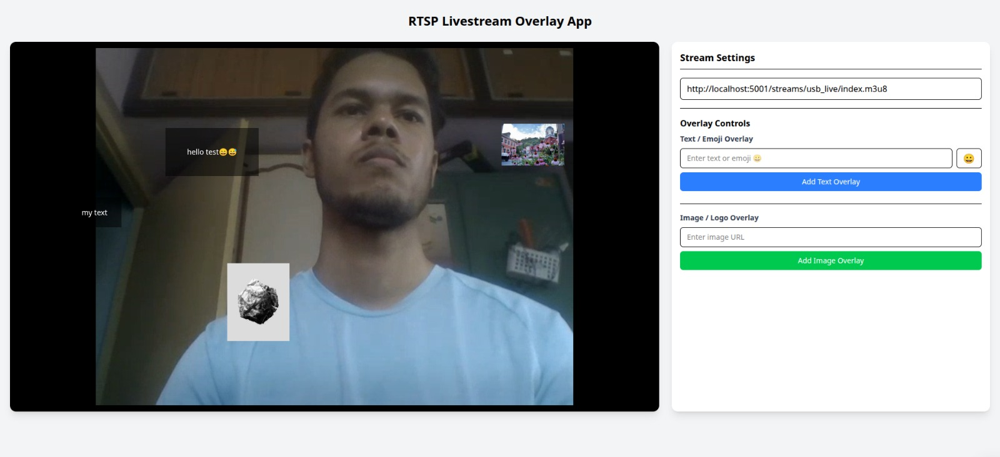
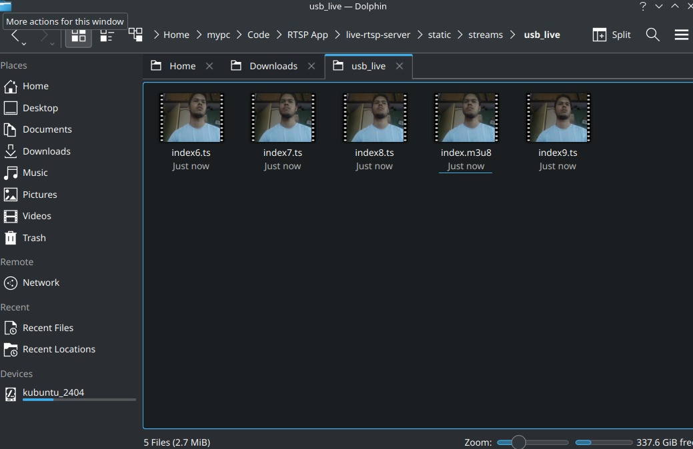
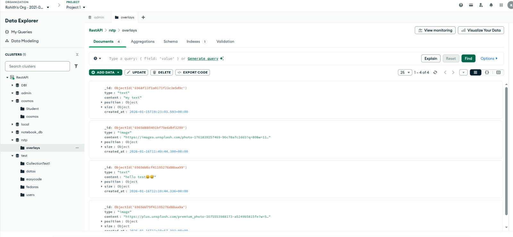
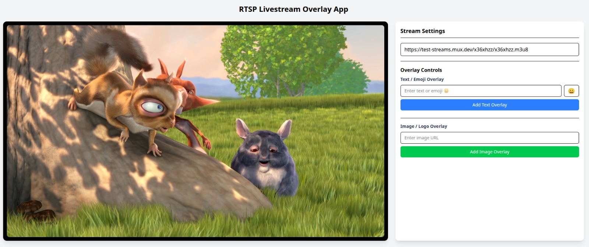

# RTSP Livestream Overlay Web Application

This documentation provides a comprehensive overview of your system architecture, technical stack, and data flow. It is designed to help collaborators understand how the USB camera stream is processed and served to the user interface.

## Live Demo 
- **Video Demo** - https://www.youtube.com/watch?v=MJlN-bK0ekE

 [](https://www.youtube.com/watch?v=MJlN-bK0ekE)

## 1. System Architecture Overview

The application is a distributed system designed for real-world video streaming and data management. It follows a Producer-Transcoder-Consumer pattern.

- **Producer**: `live-rtsp-server` captures raw hardware data.
- **Storage & Logic**: `Backend (Flask)` manages metadata (MongoDB) and serves video assets.
- **Consumer**: `Frontend (React)` provides the control interface and video playback.


## 2. Component Breakdown

### A. Live-RTSP Server (Streaming Engine)

This component is responsible for the heavy lifting of video processing.

- **Capture (OpenCV)**: Accesses the local USB/Integrated webcam.
- **RTSP Broadcaster (MediaMTX)**: Acts as the central media hub. It receives the raw stream and exposes it via the RTSP protocol at` rtsp://localhost:8554/usb_cam`.
- **Transcoder (FFmpeg)**: Pulls the RTSP stream and converts it into HLS (HTTP Live Streaming).
  - **Output**: Generates an `.m3u8` playlist and multiple .ts video segments.
  - **Latency Optimization**: Uses `ultrafast` presets and `zerolatency` tuning to minimize the delay between the camera and the browser.

### Data Flow

| Step | Process                | Protocol/Format    |
| ---- | ---------------------- | ------------------ |
| 1    | Webcam → OpenCV        | Raw Frames (BGR)   |
| 2    | OpenCV → MediaMTX      | RTSP (H.264)       |
| 3    | MediaMTX → FFmpeg      | RTSP               |
| 4    | FFmpeg → Disk Storage  | HLS (.m3u8 + .ts)  |
| 5    | Disk → Flask Server    | HTTP (Static File) |
| 6    | Flask → React Frontend | HTTP/HLS           |

### B. Backend (Flask & MongoDB)

The backend acts as the API gateway and static file host.

- **Database (MongoDB)**: Stores application state, such as overlay coordinates, camera metadata, or user settings.
- **CORS Management**: Configured to allow communication with the Vite/React dev server (`http://localhost:5173`). Since your React app is on port `5173` and Flask is on `5000`, ensure your Flask-CORS configuration allows these specific methods

```py
CORS(app, resources={r"/api/*": {"origins": "http://localhost:5173"}}, methods=["GET", "POST", "PUT", "PATCH", "DELETE"])
```

- **API Docs**

| Method    | Endpoint           | Description                                      | Payload (JSON)                                                                                                                                                               | Status Codes                  |
| --------- | ------------------ | ------------------------------------------------ | ---------------------------------------------------------------------------------------------------------------------------------------------------------------------------- | ----------------------------- |
| GET       | /api/overlays      | Retrieve all active overlays for the stream.     | [{ "type": "text", "content": "my text", "position": { "x": 98, "y": 286 }, "size": { "width": 103, "height": 57 }, "created_at": { "$date": "2026-01-15T19:23:03.593Z" } }] | 200 OK                        |
| POST      | /api/overlays      | "Create a new overlay (Text , Image, or SVG)."   | "{ ""type"": string , ""content"": string , ""x"": int ,""y"": int }"                                                                                                        | 201 Created , 400 Bad Request |
| GET       | /api/overlays/[id] | Fetch specific details of a single overlay.      | { "type": "text", "content": "my text", "position": { "x": 98, "y": 286 }, "size": { "width": 103, "height": 57 }, "created_at": { "$date": "2026-01-15T19:23:03.593Z" } }   | 200 OK, 404 Not Found         |
| PUT/PATCH | /api/overlays/[id] | Update position ,size or content of an overlay." | "{ ""x"": int , ""y"": int , ""content"": string }"                                                                                                                          | 200 OK,404 Not Found          |
| DELETE    | /api/overlays/[id] | Remove an overlay from the stream interface.     | { "message": Overlay deleted", "data" : { "\_id" : string }                                                                                                                  | 204 No Content ,404 Not Found |

### C. Frontend (React TS)

A modern dashboard built with TypeScript and Tailwind CSS.

- **Video Playback**: Utilizes `ReactPlayer` to decode and render the HLS stream.
- **Real-time Interaction**: Features draggable overlays and camera controls that persist data to the MongoDB via the Flask API.

## 3. Setup & Installation

**Prerequisites**

- Python 3.8+
- Node.js & NPM
- FFmpeg (Installed and in System PATH) - [Install ffmpeg](https://ffmpeg.org/download.html)
- Docker (For MediaMTX)
- MongoDB (Local or Atlas instance)

**Running the System - Live RTSP Server**

1. MediaMTX: Run the Docker container to start the RTSP server.

```bash
cd live-rtsp-server
bash mediamtx.sh
```

2. Scripts: Start Flask App to init `usb_to_rtsp` (Capture) and `hls_conversion` (Transcode).

```bash
cd live-rtsp-server
pip install -r requirements.txt
virtualenv venv
source venv/bin/activate #linux
python3 main.py
```

### Conversion of Live Videos to HLS compatability



**Running the System - Backend Server**

Config all variables in `.env`. Run python `main.py` to start the Flask API.

```bash
cd backend
pip install -r requirements.txt
virtualenv venv
source venv/bin/activate #linux
python3 app.py
```

### Mongodb Database


**Running the System - Client App**

Run npm run dev in the React directory.

```bash
cd frontend
npm run dev
```

### Live Camera Test


### Other playable video Test



## Other Demo m3u8/mp4 videos
- https://devstreaming-cdn.apple.com/videos/streaming/examples/img_bipbop_adv_example_fmp4/master.m3u8
- https://cph-p2p-msl.akamaized.net/hls/live/2000341/test/master.m3u8
- https://commondatastorage.googleapis.com/gtv-videos-bucket/sample/BigBuckBunny.mp4
- https://test-streams.mux.dev/x36xhzz/x36xhzz.m3u8